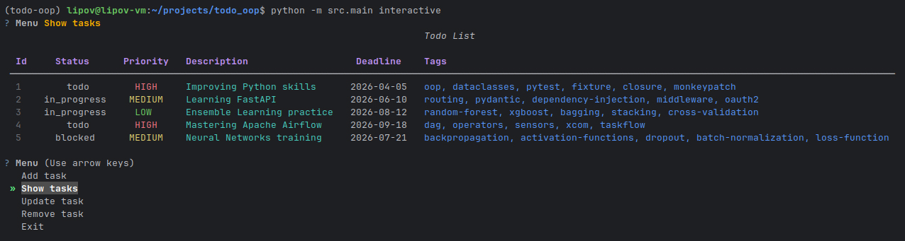
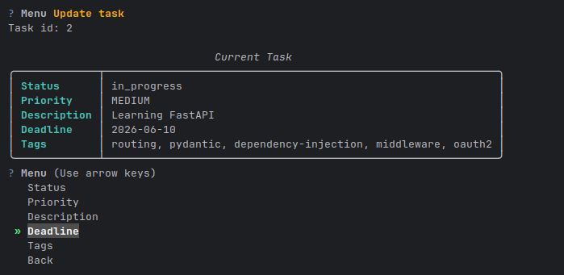
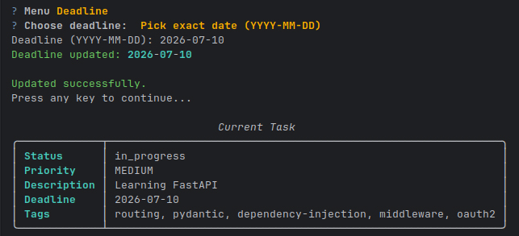

# 📝 Todo CLI App — Professional Task Manager

A fully functional CLI task manager with complete CRUD operations and JSON-based persistence —
built with a focus on clean architecture, high Python standards, and a professional GitHub workflow
(structured tasks, feature branches) mirroring real-world enterprise practices.

---

## 🧰 Tech Stack

<p align="left">
  
  
  
  
  
  
  
  
  
  
</p>

---

## 📸 Application Preview

### 📋 Task List



### ✏️ Update Task



### ✅ Updated Task



---

## 🚀 Getting Started

### 1. Install dependencies

Install `uv` (official guide):  
👉 https://docs.astral.sh/uv/getting-started/installation/#cargo

Then run:

```bash
uv sync
```

### 2. Prepare storage file

Create a file:

```bash
temp/list_task.json
```
with the following content:

```json
{
    "tasks": []
}
```

### 3. Set environment variable

First, check your project root path:
```bash
pwd
```

Example output:
```bash
/home/your_user/projects/todo_app
```

Then export the environment variable:
```bash
export STORAGE_PATH_ENV=/home/your_user/projects/todo_app/temp/list_task.json
```

### 4. Run the application

From the project root:
```bash
python -m src.main interactive
```
---

## ✅ Testing & Code Quality

### 🧪 Test Coverage
```bash
(todo-oop) lipov@lipov-vm:~/projects/todo_oop$ pytest
```
```bash
.........................................................................................................................................  [100%]
===================================================================================================== tests coverage ===========================
_____________________________________________________________________________________ coverage: platform linux, python 3.14.0-alpha-4 __________

Name    Stmts   Miss Branch BrPart    Cover   Missing
-----------------------------------------------------
TOTAL     492      0     92      0  100.00%

18 files skipped due to complete coverage.
Coverage XML written to file coverage.xml
Required test coverage of 100% reached. Total coverage: 100.00%
195 passed in 2.08s  
```

✔ Full test coverage (100%) &nbsp; ✔ All features tested

### 🧹 Code Quality
```bash
(todo-oop) lipov@lipov-vm:~/projects/todo_oop$ ruff check .
All checks passed!
```

```bash
(todo-oop) lipov@lipov-vm:~/projects/todo_oop$ ty check
Checking ------------------------------------------------------------ 74/74 files
All checks passed!
```


✔ Strict linting with Ruff &nbsp; ✔ Static typing validation with Ty

---

## 🎯 Project Goals

This project was built to:

- Develop a fully functional CLI application
- Implement complete CRUD operations
- Persist data using JSON storage
- Follow professional Python coding standards
- Apply clean architecture and separation of concerns
- Use type safety and static analysis
- Practice test-driven development (TDD)
- Work with GitHub workflow (tasks, feature branches) like in real-world enterprise environments

## 📌 Features

- Add tasks with priority, status, deadline, and tags
- List tasks in a rich formatted table
- Update tasks interactively
- Remove tasks
- Persistent storage (JSON)
- Clean CLI UX (Typer + Questionary + Rich)

---

👤 **Piotr Lipiński** 🗓️ *Finished: March 2026* 📫 *Contributions welcome!*
